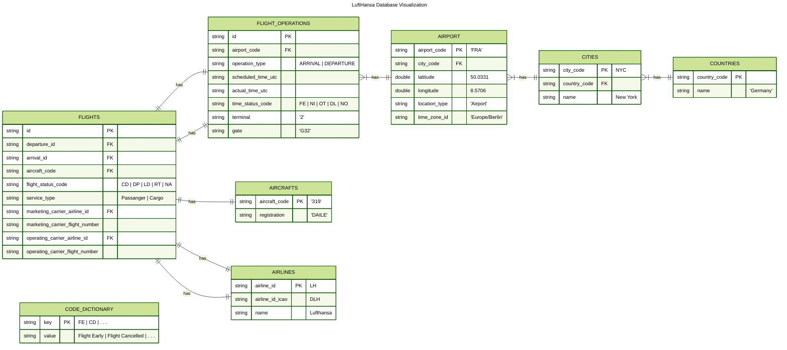

```mermaid
---
title: LuftHansa Database Visualization
config:
  theme: 'forest'
---
erDiagram
    direction LR

    FLIGHTS ||--|| FLIGHT_OPERATIONS : "has"
    FLIGHTS ||--|| FLIGHT_OPERATIONS : "has"
    FLIGHTS ||--|| AIRCRAFTS : "has"
    FLIGHT_OPERATIONS }|--|| AIRPORT : "has"
    AIRPORT }|--|| CITIES : "has"
    CITIES }|--|| COUNTRIES : "has"
    FLIGHTS ||--|| AIRLINES : has
    FLIGHTS ||--|| AIRLINES : has

    FLIGHTS {
        string id PK
        string departure_id FK
        string arrival_id FK
        string aircraft_code FK

        string flight_status_code "CD | DP | LD | RT | NA"
        string service_type "Passanger | Cargo"

        string marketing_carrier_airline_id FK
        string marketing_carrier_flight_number
        string operating_carrier_airline_id FK
        string operating_carrier_flight_number
    }

    AIRLINES {
        string airline_id PK "LH" 
        string airline_id_icao "DLH"
        string name "Lufthansa"
    }

    CODE_DICTIONARY {
        string key PK "FE | CD | . . ."
        string value "Flight Early | Flight Cancelled | . . ."
    }

    AIRPORT {
        string airport_code PK "'FRA'"
        string city_code FK

        double latitude "50.0331"
        double longitude "8.5706"

        string location_type "'Airport'"
        string time_zone_id "'Europe/Berlin'"
    }

    FLIGHT_OPERATIONS {
        string id PK
        string airport_code FK

        string operation_type "ARRIVAL | DEPARTURE"

        string scheduled_time_utc
        string actual_time_utc
        string time_status_code "FE | NI | OT | DL | NO"

        string terminal "'2'"
        string gate "'G32'"
    }

    AIRCRAFTS {
        string aircraft_code PK "'319'"
        string registration "'DAILE'"
    }

    CITIES {
        string city_code PK "NYC"
        string country_code FK

        string name "New York"
    }

    COUNTRIES {
        string country_code PK
        string name "'Germany'"
    }
```